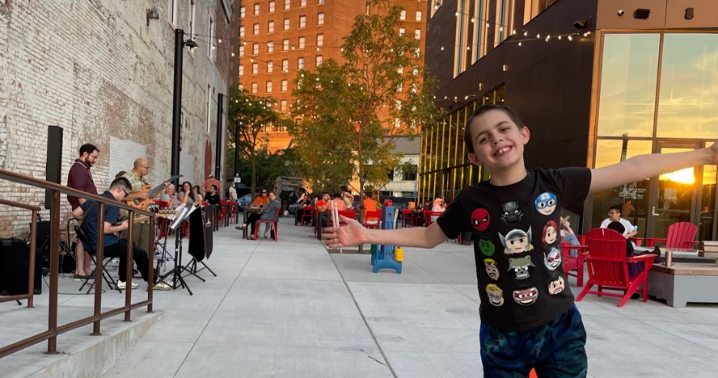
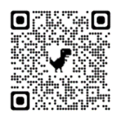
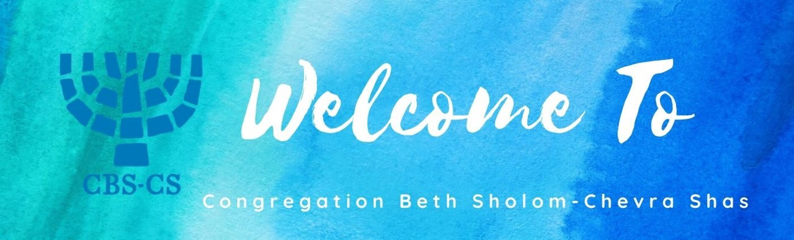

```{r setup, include=F}

# this line specifies options for default options for all R Chunks
knitr::opts_chunk$set(echo=F, scipen=100) # suppresses scientific notation

# install helper package that loads and installs other packages, if needed
if (!require("pacman")) install.packages("pacman", repos = "http://lib.stat.cmu.edu/R/CRAN/")

# install and load required packages
# flexdashboard not required for today, but make sure you can install and load it
pacman::p_load(pacman,tidyverse, gridExtra, magrittr, bslib)

# verify packages
p_loaded()

```

<center></center>

# Updates

***Zoom link, Reception, and local Covid information were last updated on January 3rd, 2022***.

-   **Please check this website for updates in the days before the event.**

-   **Our CURRENT local COVID community risk level is [LOW]{style="color:seagreen"}**

-   **IF YOU ARE ARE UNABLE TO ATTEND CBS-CS SHABBAT SERVICES IN PERSON:**

    -   [**You can attend services by Zoom using this link.**](https://cbscs.us16.list-manage.com/track/click?u=d1578de1ba9b589ebbcaf7039&id=c630495ad7&e=03b6f51c1a)

    -   [**A PDF of the program for Broden's Bar Mitzvah can be downloaded here.**](https://drive.google.com/file/d/1iSN2xC4_E7QJHEUdnAeqTUAkdVIhfkfE/view?usp=share_link)

<br>

-   **RECEPTION MUSIC REQUESTS:**

    -   [**Submit your music requests here.**](https://forms.gle/vViRQXy7qXb8PZHF7)

    -   There will be a spotify playlist playing at the evening reception and I will add requested music.

<br>

-   If your child (or you) would like to join in the **Foam Dart Fun** at the reception:

    -   [**Please complete this waiver form.**](https://www.rochesterfoamdartleague.com/new-page)**.**

    -   [**Feel free to learn more about the Rochester Foam Dart League here.**](https://www.rochesterfoamdartleague.com/)

<br>

-   **PICTURES**

    -   No cameras or phones should be used in the synagogue on Shabbat.

    -   At the reception, There will be a selfie picture area that will save and share pics.

    -   If you take other pics and want to share them:

        -   **[you can upload pics at this link: www.tiny.one/wkndpics](https://drive.google.com/drive/folders/1GBHiBtxkAIJn-DK_NlUarTmSPJg1P6JA?usp=sharing) or use this QR Code:**

<center></center>

<br>

# Contact Information

If you have questions or concerns or your plans have changed, please feel free to reach out to me (Penelope, Broden's mom):

-   **Call or text: 540-250-1096**
-   **Email: [pspooler\@syr.edu](mailto:pspooler@syr.edu){.email}**
-   **Mailing Address: 202 Old Lyme Road, Syracuse, NY 13224**

<br>

# Hotel Information

We reserved a block of rooms at [**The Craftsman Inn & Suites**](https://www.craftsmaninn.com/) where we will have a reception on Saturday evening (January 7th, 5:30 PM - 9:30 PM).

To get the group rate:

-   Please call The Craftsman at **315-637-8000**.
-   Let them know you are attending the **Eisenbies Bar Mitzvah**

**NOTE:** This block of rooms is no longer being held open, but if you need a room there, you can still call the hotel and/or me and we will try to accomodate you or help you find an alternative.

<br>

# Transportation

-   Airport: [Syracuse International (SYR)](https://syrairport.org/)

-   Train: [Amtrak at Syracuse Regional Transportation Center](https://www.amtrak.com/stations/syr)

-   Bus: [Centro at Syracuse Regional Transportation Center](https://www.centro.org/service_schedules/william-f-walsh-regional-transportation-center)

<br>

<center></center>

# Synagogue Information

-   Shabbat service will be held at [**Congregation Beth Shalom-Chevra Shas**](https://www.cbscs.org/)

-   Address and Link to Map: [**18 Patsy Lane, Jamesville, NY 13078**](https://www.google.com/maps/place/18+Patsy+Ln,+Jamesville,+NY+13078/@43.0233009,-76.0751064,17z/data=!3m1!4b1!4m5!3m4!1s0x89d98cafe156c27f:0x6d6c4db54556f487!8m2!3d43.0233009!4d-76.0751064)

-   **IF YOU ARE ARE UNABLE TO ATTEND CBS-CS SHABBAT SERVICES IN PERSON:**

    -   [**You can attend services by Zoom using this link.**](https://cbscs.us16.list-manage.com/track/click?u=d1578de1ba9b589ebbcaf7039&id=c630495ad7&e=03b6f51c1a)

    -   [**A PDF of the program for Broden's Bar Mitzvah can be downloaded here.**](https://drive.google.com/file/d/1iSN2xC4_E7QJHEUdnAeqTUAkdVIhfkfE/view?usp=share_link)

<br>

## Bar Mitzvah

Thank you for joining us on this joyous Shabbat as Broden accepts the responsibility of his Jewish heritage as a Bar Mitzvah (son of the commandments).

Becoming a Bar Mitzvah means that Broden is now responsible for his actions, both ritual and ethical, and today he publicly accepts this responsibility in front of his family and friends.

Broden's participation affirms his adult status within the Jewish community; he is now able to fulfill commandments and assume religious responsibilities.

<br>

## Shabbat Service

-   Shabbat service begins at 9:30 and will conclude around 12:00 PM. It consists of multiple parts:

    -   Shacharit, the introductory morning service

    -   Torah Service

    -   Musaf and Concluding Prayers

    -   Kiddush, the blessing of wine and food before

-   After the Kiddush prayers, we invite you to join us for lunch at the synagogue.

<br>

## Synagogue Etiquette

### Synagogue Covid Policy

-   Individuals who attend in-person are expected to

    -   be vaccinated and boosted, as recommended, and eligible to attend.

    -   be without COVID-related symptoms or fever.

    -   follow CDC recommendations for isolation and quarantine, including getting tested if exposed to a person with COVID.

### Synagogue Covid Safey Measures

-   high-level air filtration system

-   Ample and distanced-seating options (but attendance may be higher for events)

-   Face masks provided for all

### Synagogue masking policy:

-   **If our local COVID community risk level is:**

    -   [**HIGH**]{style="color:darkred"}**:** All must wear a well-fitted mask when indoors at CBS-CS except when eating.

    -   [**MEDIUM**]{style="color:goldenrod"}**:** Mask use will be optional when indoors at CBS-CS.

    -   [**LOW**]{style="color:seagreen"}**:** Mask use will be optional when indoors at CBS-CS.

-   **12/31/22: Our CURRENT local COVID community risk level is [LOW]{style="color:seagreen"}**

    -   **Please check this website for updates in the days before the event.**

### Shabbat Etiquette

-   Electronics (except medical devices) and photography are not permitted anywhere in the building or on the synagogue grounds during shabbat.

-   Please turn off your cell phone before entering the building.

    -   If you must make a phone call, please go outside and step away from the building.

-   Everyone is encouraged to wear one of the inscribed kippot (head coverings) Broden has selected for his special day.

    -   You will find them in a basket in the entryway.

    -   Feel free to take yours home!

    -   Males of all ages and religious backgrounds are required to wear a kippah while in the sanctuary.

-   Be mindful that a service is not a performance. Please refrain from applauding.

-   Save your congratulations for after services are over.

-   Please do not place a siddur (prayer book) or chumash (Five Books of Moses) on the floor.

-   If you would like to give Broden a card or gift, please bring it to the evening reception or give it to one his parents outside of the sanctuary.

-   If you are driving your child and/or someone else, please arrange to pick them up around 1:15 PM or 1:30 PM. Texting or calling from the synagogue is discouraged.

-   We realize that for some of you this will be your first time attending a synagogue service and this might seem like a lot of rules.

    -   **Please, don't worry.**

    -   These notes are intended to help you feel more comfortable, not to worry you.

    -   We make mistakes too and our synagogue is very welcoming and relaxed.

-   Do not hesitate to ask us, or one of the synagogue ushers, any questions you may have.

<br>

# Evening Reception

-   There will be an evening reception at The Craftsman from 5:30 PM to 9:30 PM on January 7th.

-   Please join us for some great food and drinks to celebrate Broden's accomplishment.

    -   Hors d'Oeuvres and Buffet Dinner - Kosher-Style (Fish, Dairy and Vegetarian)

    -   Open Bar

    -   Selfie Picture Area

    -   Spotify Music Playlist [**Submit your music requests here.**](https://forms.gle/vViRQXy7qXb8PZHF7)

        -   There will be a spotify playlist playing at the evening reception and I will add requested music.

<br>

-   Separate pre-teen entertainment provided by [**Rochester Foam Dart League**](https://www.rochesterfoamdartleague.com/).
    -   Young people (and child-like adults) can join in the foam-dart fun from 6 to 8 PM.
    -   [**Please complete this waiver form to participate in Foam Dart Fun.**](https://www.rochesterfoamdartleague.com/new-page)

<br>

# Fun Things to Do in CNY in January

-   More ideas may be added to the list below before January.

-   Please let us know if you have questions.

<br>

## If you like cold weather:

### [Green Lakes](https://parks.ny.gov/parks/greenlakes/details.aspx)

-   Gorgeous year round. Trails are not plowed but park roads are.

-   Great place to run and hike all year long.

-   Bring snow boots and/or cross-country skis and enjoy the trails around the lakes.

### [Jamesville Beach Park](https://onondagacountyparks.com/parks/jamesville-beach-park/)

-   The Beach is closed but there are miles of trails for dogs and humans.

-   This our favorite close-by place to go hiking with our dogs.

### [Clark Reservation](https://parks.ny.gov/parks/clarkreservation/details.aspx)

-   Beautiful trails and views.

<br>

## If you prefer staying warm:

### [Destiny Mall](https://www.destinyusa.com/)

-   It is huge and has everything.

-   Also has indoor activity areas and a great cineplex

### [Everson Museum](https://everson.org/about/)

-   A premier museum with permanent and constantly changing exhibits and offerings

### [Syracuse University Art Museum](https://museum.syr.edu/)

-   An impressive teaching museum featuring diverse permanent and rotating exhibits
